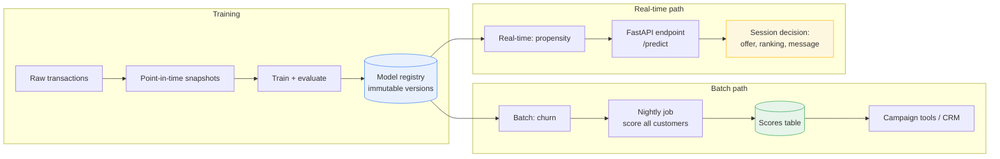

# Deployment

How the models in this platform get from `outputs/` into something a business system can call — the design decisions first, then the implementation in `serving/`.

## Serving mode: why batch for churn, real-time for propensity

---

## Two serving paths, one model bundle



Both paths load the same bundle through `serving/model_loader.py`, so promoting a model to either mode requires no retraining and no code change — only a registry pointer.

## Choosing the path: latency tolerance drives the design

| | **Churn → batch** | **Propensity → real-time** |
|---|---|---|
| When the answer is needed | Before tomorrow's campaign send | Within a page load |
| Latency tolerance | Hours — the job can run all night | Milliseconds — p99 budget of 50ms |
| Freshness required | Daily is plenty; 180-day risk moves slowly | Must reflect the current session |
| Consumer | CRM, campaign tools pulling a list | Web/app making a live decision |
| Failure mode | Job fails → rerun it, nobody notices | Endpoint slow → user sees a worse page |
| Cost profile | Cheap: one big job, no idle capacity | Pays for idle capacity to absorb spikes |
| Scaling lever | Bigger box or chunked processing | More replicas behind a load balancer |

The rule of thumb: **if the decision can wait, batch it.** Real-time serving costs more in infrastructure, monitoring, and on-call burden, so it should be reserved for decisions that genuinely can't wait. Churn can't justify that cost; in-session propensity can.

### Measured latency

`serving/benchmark.py`, 400 sequential requests against a single uvicorn process:

| Metric | Value |
|---|---|
| p50 | 1.15 ms |
| p95 | 1.35 ms |
| p99 | 1.57 ms |
| max | 2.82 ms |
| Throughput | ~846 req/s (single process, no concurrency) |

Two caveats worth stating out loud: this is a local loopback measurement with no network hop, no feature-store lookup, and no concurrency — so it's a **floor**, not a production SLO. In production the dominant cost would be the feature fetch, not the model. And a linear model is cheap; a gradient-boosted ensemble would move p99 into the 5-15ms range, still comfortably inside a 50ms budget.

Reproduce with:

```bash
uvicorn serving.api:app --port 8000     # terminal 1
python -m serving.benchmark --n 500     # terminal 2
```

Churn scores change slowly (a customer's 180-day risk doesn't move minute to minute) and are consumed by campaign tools that pull lists on a schedule. That makes a **nightly batch job** the right default: cheaper, easier to monitor, and trivially re-runnable if a scoring run is wrong.

Purchase propensity is different — it's most useful *during* a session, when the decision (what to show, whether to offer an incentive) is being made. That argues for a **low-latency endpoint** with a strict latency budget.

Both modes here load the identical model bundle through the same loader, so a model can be promoted to either without retraining. `serving/batch_score.py` is the batch path; `serving/api.py` is the real-time path.


## Model registry: versioned, immutable, self-describing

```
registry/
├── model_v1/
│   ├── model.pkl                # the fitted pipeline
│   ├── feature_metadata.json    # feature names + order, target, train timestamp, data source
│   └── metrics.json             # holdout metrics at training time
└── model_v2/ ...
```

Three properties matter:

- **Immutable versions.** A version directory is written once and never edited. Rollback is repointing to `model_v1`, not retraining.
- **Metrics travel with the model.** `/health` reports the AUC the live model achieved at training, so anyone can see what's actually serving without digging through a notebook.
- **The feature contract travels with the model.** This is what makes skew detection possible (below).

## Preventing train/serve skew

The most common production ML failure isn't a bad model — it's a good model receiving features that differ from what it was trained on: renamed columns, reordered inputs, a unit change upstream.

`serving/model_loader.validate_features()` compares every incoming request against `feature_metadata.json` and rejects on mismatch — missing features *and* unexpected ones — then reorders values into training order before inference. Requests fail loudly with a 400 rather than being silently imputed. In serving, silence is how skew becomes a slow revenue leak nobody notices for a quarter.

## Promotion and rollback

```
train → evaluate on holdout → compare against current production version
      → register as new version → shadow/canary → promote → monitor
```

Promotion criteria should be decided before the run, not after seeing results: a minimum AUC, no degradation on key segments, and calibration within tolerance. Because versions are immutable and metrics are stored alongside each one, "which model was live on March 3rd, and how good was it?" is answerable — which is what auditability means in practice.

## What to monitor (beyond uptime)

| Signal | Why it matters | Trigger |
|---|---|---|
| Feature drift (PSI per feature) | Inputs shifting away from training distribution | PSI > 0.2 → investigate |
| Score distribution shift | Model output drifting even when inputs look stable | Mean score moves > 2 SD from baseline |
| Calibration decay | Predicted 20% risk no longer means 20% actual | Recalibrate or retrain |
| Null/default rate per feature | Upstream pipeline silently breaking | Any sustained increase |
| Latency p50/p95/p99 | Real-time path degrading | p99 above the agreed budget |

Uptime tells you the service is running. None of the above are visible from uptime — a model can be 100% available and quietly wrong for weeks.

## Retraining triggers

Scheduled retraining (monthly) as a baseline, plus event-driven retraining on: sustained feature drift, calibration decay past tolerance, or a known upstream change (new data source, changed business rule). Retraining always produces a *new version* evaluated against the incumbent — never an in-place overwrite.

## What this demo deliberately omits

| Omitted here | Production equivalent |
|---|---|
| Pickle files in a local directory | Vertex AI Model Registry / MLflow with artifact storage |
| Single container, no scaling | Vertex AI Endpoints or GKE with horizontal autoscaling |
| Features passed in the request body | Feature store (Feast / Vertex Feature Store) with point-in-time lookups |
| Manual promotion | CI/CD pipeline gated on evaluation thresholds |
| No shadow deployment | Shadow traffic to the candidate before promotion |
| Logging to stdout | Structured logging + metrics to a monitoring backend |

Each omission is a deliberate scope decision for a demo, not an oversight — the interfaces above are what would need to change, and none of them require rewriting the training code.

---

## Running it

```bash
pip install -r requirements-serving.txt

# 1. Train and register a demo model (stands in for the real training pipeline)
python -m serving.make_demo_model

# 2. Real-time path
uvicorn serving.api:app --reload
curl http://127.0.0.1:8000/health
curl -X POST http://127.0.0.1:8000/predict \
  -H "Content-Type: application/json" \
  -d '{"customer_id":"c_999","features":{"recency_days":150,"frequency_90d":0,"monetary_90d":20,"tenure_days":90,"support_tickets_90d":5,"web_sessions_30d":1}}'

# 3. Batch path
python -m serving.batch_score --input customers.csv --output scores.csv

# 4. Tests
pytest tests/ -v
```

Interactive API docs are generated automatically at http://127.0.0.1:8000/docs.

### Docker

```bash
docker build -t cip-serving .
docker run -p 8000:8000 cip-serving
```
